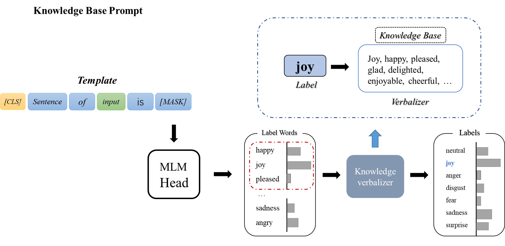








I’m now a fourth‐year undergraduate student in Northeastern University (Shenyang, China), and affiliated with the School of Computer Science and Engineering.

My research interests include Deep Learning(DL), Multimodal Learning, Natural Language Processing(NLP) and Information Retrieval(IR).

I am looking for a **Gap-year RA/Phd 24-Spring/Phd 24-Fall**. Here is my [CV](https://github.com/QC-LY/QC-LY.github.io/blob/main/files/lyhy-cv.pdf).

# 📝 Publications 

ICLR 2023

<!-- [Deep Residual Learning for Image Recognition](https://openaccess.thecvf.com/content_cvpr_2016/papers/He_Deep_Residual_Learning_CVPR_2016_paper.pdf) -->
Universal Vision-Language Dense Retrieval: Learning A Unified Representation Space for Multi-Modal Retrieval, **ICLR 2023**

[[pdf](https://openreview.net/pdf?id=PQOlkgsBsik)][[code](https://github.com/OpenMatch/UniVL-DR)]

Zhenghao Liu, Chenyan Xiong, **Yuanhuiyi Lv**, Zhiyuan Liu, Ge Yu

This paper presents Universal Vision-Language Dense Retrieval (UniVL-DR), which builds a unified model for multi-modal retrieval. UniVL-DR encodes queries and multi-modality resources in an embedding space for searching candidates from different modalities.

<!-- [**Project**](https://scholar.google.com/citations?view_op=view_citation&hl=zh-CN&user=DhtAFkwAAAAJ&citation_for_view=DhtAFkwAAAAJ:ALROH1vI_8AC) <strong></strong>
- Lorem ipsum dolor sit amet, consectetur adipiscing elit. Vivamus ornare aliquet ipsum, ac tempus justo dapibus sit amet. 

- [Lorem ipsum dolor sit amet, consectetur adipiscing elit. Vivamus ornare aliquet ipsum, ac tempus justo dapibus sit amet](https://github.com), A, B, C, **CVPR 2020** -->

# 💻 Projects

<!-- [Deep Residual Learning for Image Recognition](https://openaccess.thecvf.com/content_cvpr_2016/papers/He_Deep_Residual_Learning_CVPR_2016_paper.pdf) -->
[Prompt Tuning For Sentiment Classification Base On Pre‐trained Language Models](https://github.com/QC-LY/Prompt-Tuning-For-Sentiment-Classification)

We explore the differences in performance among Full Fine‐tuning, Bias‐term Fine‐tuning and Prompt‐tuning in the process of building a pre‐ training‐based sentiment classification model. To improve the performance of the prompt, we build a knowledge‐based verbalizer by acquiring knowledge from WordNet.

[Fundus Image Segmentation Base On U‐Net](https://github.com/QC-LY/Fundus-Image-Segmentation)

We used U‐net to classify the fundus image at the pixel level, setting the pixels in the vascular region to 1 and the pixels in the non‐vascular region to 0 to create a binary image that would segment the vascular region in the 2D fundus image.

# 📖 Educations
- *2019.09 - 2023.06 (now)*,  Bachelor in Artificial Intelligence, Northeastern University, Shenyang, China. 

# 🎖 Honors and Awards
- *2020.09* **Outstanding Students Scholarship**, Northeastern University. 
- *2021.09* **Outstanding Students Scholarship**, Northeastern University. 
- *2023.09* **Outstanding Students Scholarship**, Northeastern University.
- *2021.11* **The First Prize in China Undergraduate Mathematical Contest in Modeling**, CSIAM.

<!-- # 💬 Invited Talks
- *2021.06*, Lorem ipsum dolor sit amet, consectetur adipiscing elit. Vivamus ornare aliquet ipsum, ac tempus justo dapibus sit amet. 
- *2021.03*, Lorem ipsum dolor sit amet, consectetur adipiscing elit. Vivamus ornare aliquet ipsum, ac tempus justo dapibus sit amet.  \| [\[video\]](https://github.com/)

# 💻 Internships
- *2019.05 - 2020.02*, [Lorem](https://github.com/), China. -->
