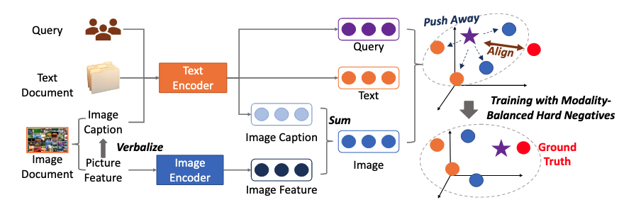








I’m now a fourth‐year undergraduate student in Northeastern University (Shenyang, China), and affiliated with the School of Computer Science and Engineering.

My research interests include Deep Learning(DL), Multimodal Learning, Natural Language Processing(NLP) and Information Retrieval(IR).

I am looking for a gap-year RA/Phd 24-Spring/Phd 24-Fall.

# 📝 Publications 

ICLR 2023

Universal Vision-Language Dense Retrieval: Learning A Unified Representation Space for Multi-Modal Retrieval

[[pdf](https://openreview.net/pdf?id=PQOlkgsBsik)][[code](https://github.com/OpenMatch/UniVL-DR)]

Zhenghao Liu, Chenyan Xiong, **Yuanhuiyi Lv**, Zhiyuan Liu, Ge Yu

This paper presents Universal Vision-Language Dense Retrieval (UniVL-DR), which builds a unified model for multi-modal retrieval. UniVL-DR encodes queries and multi-modality resources in an embedding space for searching candidates from different modalities.

# 📖 Educations
- *2019.09 - 2023.06 (now)*,  Bachelor in Artificial Intelligence, Northeastern University, Shenyang, China. 

# 🎖 Honors and Awards
- *2020.09* Outstanding Students Scholarship, Northeastern University. 
- *2021.09* Outstanding Students Scholarship, Northeastern University. 
- *2023.09* Outstanding Students Scholarship, Northeastern University.
- *2021.11* The First Prize in China Undergraduate Mathematical Contest in Modeling, CSIAM.

<!-- # 💬 Invited Talks
- *2021.06*, Lorem ipsum dolor sit amet, consectetur adipiscing elit. Vivamus ornare aliquet ipsum, ac tempus justo dapibus sit amet. 
- *2021.03*, Lorem ipsum dolor sit amet, consectetur adipiscing elit. Vivamus ornare aliquet ipsum, ac tempus justo dapibus sit amet.  \| [\[video\]](https://github.com/)

# 💻 Internships
- *2019.05 - 2020.02*, [Lorem](https://github.com/), China. -->
